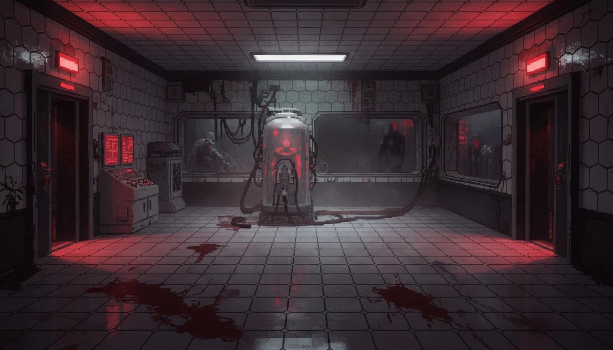

<p align="center">
  
</p>

<h1 align="center">🧟 RESIDENT LOCKDOWN</h1>

<p align="center">
  <strong>A real-time multiplayer elimination quiz game with a Resident Evil–inspired survival horror aesthetic.</strong>
</p>

<p align="center">
  
  
  
  
</p>

---

## 🎮 What is Resident Lockdown?

**Resident Lockdown** is an intense, real-time multiplayer quiz game designed for live events, classrooms, and game nights. Players register and compete through escalating rounds of riddles, logic puzzles, and brain teasers — all wrapped in a dark, cinematic Resident Evil–inspired UI with biohazard containment theming.

**The stakes are real.** Wrong answers raise your infection level. Get infected too much and you're **eliminated**. Only the sharpest minds survive.

---

## 🏗️ Game Flow

```
📝 Registration → 🧩 Level 1 (10 Riddles) → 📊 Shortlist → 🧠 Level 2 (5 Brain Teasers) → 🏆 Champions
```

| Phase | Description |
|---|---|
| **Registration** | Players join the lobby via a simple name entry screen |
| **Level 1** | 10 riddle-style questions. Each player plays at their own pace with a per-question timer |
| **Shortlist** | Top 10 players survive and advance. The rest are eliminated |
| **Level 2** | 5 harder brain teasers for survivors. First to finish waits for others |
| **Champions** | Top 5 players after Level 2 are crowned **Champions** with a victory animation |

---

## ⚡ Features

- 🔴 **Real-time multiplayer** via WebSockets (Socket.IO)
- 🧩 **Per-player question flow** — everyone plays at their own pace
- 🏆 **Top 10 shortlist → Top 5 champions** elimination system
- 🦠 **Infection mechanic** — wrong answers increase infection; 100% = eliminated
- 👀 **Admin spectate mode** — watch all players live from the admin dashboard
- 🤖 **Bot system** — add 15 test bots from the admin panel to simulate a full game
- 📊 **Live leaderboard** — real-time score updates for players and spectators
- ⏱️ **Configurable timers** — adjust per-question time from the admin panel
- 🎨 **Resident Evil aesthetic** — CRT effects, biohazard theming, dark industrial UI
- 📱 **Responsive** — works on desktop and mobile

---

## 🛠️ Tech Stack

| Layer | Technology |
|---|---|
| **Frontend** | React 19, TypeScript, Vite, Framer Motion, Tailwind CSS |
| **Backend** | Node.js, Express, Socket.IO |
| **Icons** | Lucide React |
| **Deployment** | Render (or any Node.js host) |

---

## 🚀 Getting Started

### Prerequisites
- Node.js 18+
- npm

### Installation

```bash
# Clone the repository
git clone https://github.com/ayush5e6e21/resident-lockdown.git
cd resident-lockdown

# Install dependencies
npm install
```

### Run Locally

```bash
# Terminal 1: Start the backend
npm run server

# Terminal 2: Start the frontend
npm run dev
```

- Frontend: `http://localhost:5173`
- Backend: `http://localhost:3001`

### Admin Access

Open the admin panel from the landing page. Password: `joker`

From the admin panel you can:
- Add 15 test bots
- Start/reset the game
- Adjust L1/L2 question timers
- Spectate all players live
- Manage the question bank (password: `jarvis`)

---

## 🌐 Deployment (Render)

1. Push your code to GitHub
2. Create a **Web Service** on [Render](https://render.com)
3. Configure:
   - **Build Command:** `npm install && npm run build`
   - **Start Command:** `node server.js`
4. Add environment variables:
   - `VITE_SERVER_URL` = `https://your-app.onrender.com`
   - `NODE_ENV` = `production`
5. Deploy! Both frontend and backend run from a single process.

---

## 📋 Scoring System

| Action | Effect |
|---|---|
| Correct answer (L1) | **+50 score** |
| Correct answer (L2) | **+100 score** |
| Wrong answer (L1) | **+15% infection** |
| Wrong answer (L2) | **+25% infection** |
| Timeout (no answer) | **+20% infection** |
| Correct answer | **-5% infection** (small heal) |
| Infection ≥ 100% | **Instant elimination** |

---

## 📁 Project Structure

```
├── server.js              # Express + Socket.IO backend
├── src/
│   ├── context/
│   │   └── GameContext.tsx # Socket connection & game state
│   ├── components/
│   │   └── screens/
│   │       ├── LandingScreen.tsx
│   │       ├── LobbyScreen.tsx
│   │       ├── Level1Screen.tsx
│   │       ├── Level2Screen.tsx
│   │       ├── TransitionScreen.tsx
│   │       ├── VictoryScreen.tsx
│   │       ├── EliminatedScreen.tsx
│   │       └── AdminScreen.tsx
│   └── types/
│       └── game.ts
├── images/
│   └── bg-containment.jpg
└── package.json
```

---

## 📄 License

This project is for educational and entertainment purposes.

---

<p align="center">
  <strong>🧟 Can you survive the lockdown? 🧟</strong>
</p>
